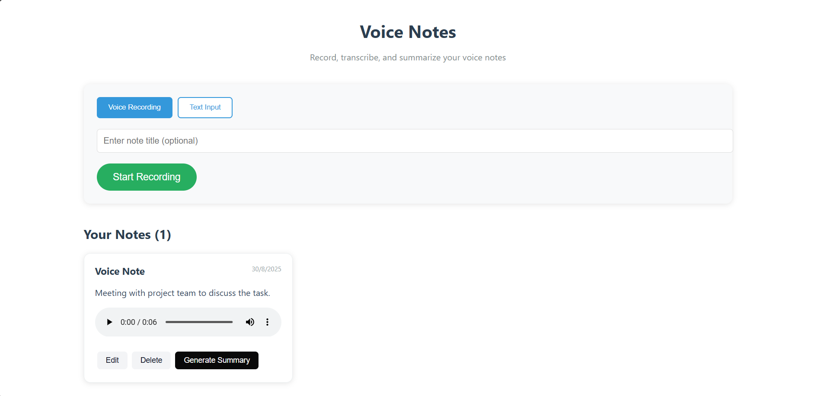

# Voice Notes with AI Summarization (MERN + GenAI)

> Simple Voice Notes app using the MERN stack with GenAI (Google Gemini) integration for **transcription** and **summarization**.

---

## Overview
This repository implements a Voice Notes manager where users can record audio notes, the backend transcribes audio into text using a GenAI speech-to-text API, users can edit or delete notes, and an LLM (GenAI) can generate a short summary for any note.

Key behaviors:
- Upload audio → server automatically transcribes (first step).
- User can edit transcript; if edited, any existing summary is cleared and the “Generate Summary” action becomes available again.
- User can generate a summary (uses GenAI) — after generation, the summary button is disabled until the transcript is changed.

---

## Features
- Record audio (frontend) and upload to backend
- Persist notes in MongoDB (title, audio URL, transcript, summary, flags)
- Edit / Delete notes
- Generate AI-powered summary (one-time until transcript changed)
- Clean UI and mobile-friendly layout

---

## Tech Stack
- Frontend: React.js (hooks, axios)
- Backend: Node.js + Express
- DB: MongoDB
- GenAI:Google Gemini (Generative AI) for transcription & summarization

---

## Repository Structure (example)
```
backend/
  ├─ index.js              # app entry (loads env, starts server)
  ├─ config/db.js         # mongo connection
  ├─ models/VoiceNote.js  # mongoose schema
  ├─ routes/notes.js      # notes API
  ├─ services/gemini.js   # transcription + summary functions
  └─ uploads/             # uploaded audio files

frontend/
  ├─ package.json
  ├─ src/
  │   ├─ App.jsx          # main UI
  │   ├─ api.js           # axios wrapper
  │   └─ components/      # UI components
  └─ public/
```

---

## Requirements
- Node.js (>=16)
- npm or yarn
- MongoDB (local or Atlas)
- API key for chosen GenAI provider (OpenAI or Google Gemini)

---

## Environment Variables
Create a `.env` file in the `backend/` folder with values like:

```
PORT=5000
MONGODB_URI=mongodb://localhost:27017/voicenotes
GEMINI_API_KEY=YOUR_GOOGLE_GENAI_API_KEY_HERE
```

> NOTE: If you use Google Gemini, make sure the API key has access to the `generativelanguage.googleapis.com` service.

---

## Backend Setup (run in `/backend`)

1. Install dependencies

```bash
cd backend
npm install
```

2. Add `.env` (see above)

3. Run the backend

```bash
npm run dev
# or
node index.js
```

The backend will serve these HTTP routes (examples):

```
GET  /api/notes               # list notes
POST /api/notes               # upload audio or provide transcript
PUT  /api/notes/:id           # update title/transcript
POST /api/notes/:id/summary   # generate summary for note (LLM)
DELETE /api/notes/:id         # delete note + audio file
```

### Notes on transcription & summary flow
- `POST /api/notes` with `multipart/form-data` and `audio` file will cause server to:
  1. store audio in `uploads/`
  2. call `generateTranscript(audioFilePath)` which sends the audio to the GenAI provider and returns plain text transcript
  3. create a `VoiceNote` entry with `transcript` populated and `summary` empty
- `POST /api/notes/:id/summary` will call the LLM on the stored `transcript` and populate `summary` and flags (`hasSummary`, `isEdited=false`). If `hasSummary` and `isEdited==false`, the server returns the existing summary without regenerating.
- On `PUT /api/notes/:id` when transcript is changed, server clears `summary`, sets `hasSummary=false` and `isEdited=true`.

---

## Frontend Setup (run in `/frontend`)

1. Install dependencies

```bash
cd frontend
npm install
```

2. Environment (example `.env` in frontend if needed)
```
REACT_APP_API_BASE_URL=http://localhost:5000/api
```

3. Start dev server

```bash
npm start
```

### Frontend behavior
- Recording UI captures audio (MediaRecorder) and sends `FormData` with `audio` and `title` to `POST /api/notes`.
- After upload completes, UI shows the created note with `transcript` text and action buttons: Edit, Delete, Generate Summary.
- When user clicks **Generate Summary**, frontend calls `POST /api/notes/:id/summary` and then disables the Summary button for that note (until user edits the transcript).
- When user edits transcript and hits Save, frontend calls `PUT /api/notes/:id` and re-enables the summary button.
---

## screenshots


## About Me

I am a software developer with experience in building full-stack web applications using modern technologies. I enjoy learning new tools and frameworks, and I am passionate about creating efficient and user-friendly software solutions. Feel free to reach out to me for any questions or collaboration opportunities!

- Rampal Yadav
- Email: rampalyadav23082001@gmail.com.
